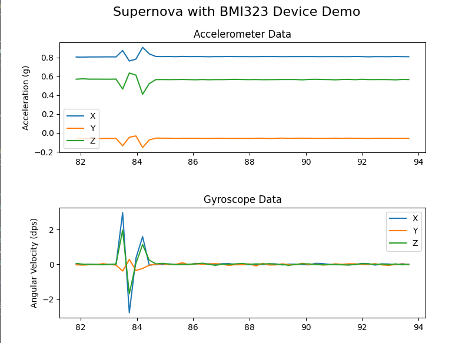

# Demo Supernova with Bosch's sensor BMI323

This folder contains a demonstration project for interfacing with a BMI323 sensor using the Supernova host adapter connected to the I3C High Voltage bus. The project showcases how to initialize the sensor, read accelerometer and gyroscope data in real-time, and visualize this data using `matplotlib` in Python.



## Introduction

The project provides a Python script (`BMI323_run.py`) that interfaces with a BMI323 sensor. It demonstrates initializing the sensor, calibrating it, reading accelerometer and gyroscope data, and plotting this data in real time.

## Prerequisites

- Python 3.10
- Supernova host adapter
- BMI323 sensor connected to the I3C High Voltage bus

## Installation

1. **Create and Activate a Virtual Environment:**

   It's recommended to create a virtual environment to manage dependencies.

   - On Windows:

     ```bash
     python -m venv venv
     .\venv\Scripts\activate
     ```

   - On macOS and Linux:

     ```bash
     python3 -m venv venv
     source venv/bin/activate
     ```

   You should now see `(venv)` in your command line, indicating that the virtual environment is active.

2. **Install Dependencies:**

   Use the provided `requirements.txt` to install the necessary Python packages.

   ```bash
   pip install -r requirements.txt
   ```

## Usage

Run the script using Python:

```bash
python BMI323_run.py
```

The script will open a window displaying two real-time plots: one for accelerometer data and another for gyroscope data from the BMI323 sensor. Press 'q' to exit the plot and stop the script.

To exit the virtual environment, use:

```bash
deactivate
```
