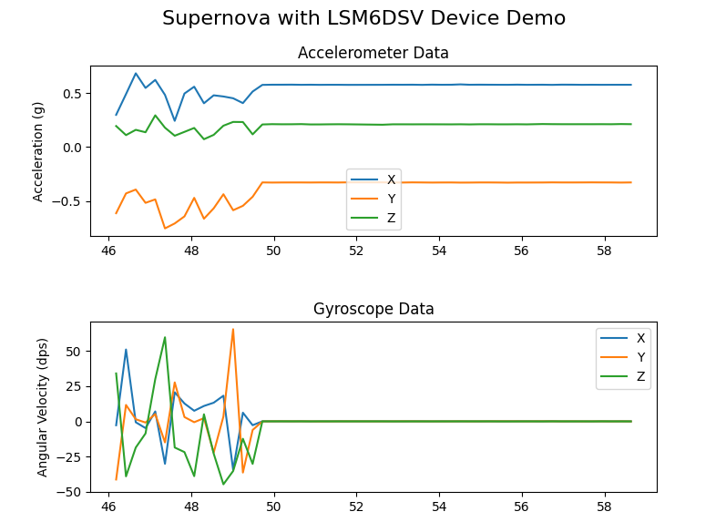
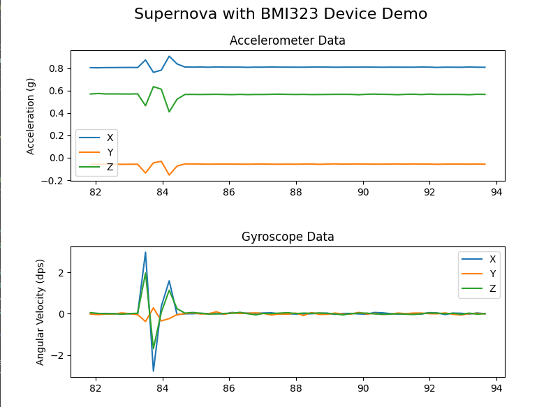

# Demo Supernova with STMicroelectronics sensor LSM6DSV and Bosch sensor BMI323

This folder contains a demonstration project for interfacing with LSM6DSV and BMI323 sensors simultaneously using the Supernova host adapter connected to the I3C High Voltage bus. The project showcases how to initialize both sensors, read accelerometer and gyroscope data in real-time, and visualize this data using `matplotlib` in Python.




## Introduction

The project provides a Python script (`LSM6DSV_and_BMI323_run.py`) that interfaces with a STMicroelectronics LSM6DSV and a Bosch BMI323 sensors. It demonstrates initializing both sensors, calibrating them, reading accelerometer and gyroscope data, and plotting this data in real time.

## Prerequisites

- Python 3.10
- Supernova host adapter
- LSM6DSV and BMI323 sensors connected to the I3C High Voltage bus

## Installation

1. **Create and Activate a Virtual Environment:**

   It's recommended to create a virtual environment to manage dependencies.

   - On Windows:

     ```bash
     python -m venv venv
     .\venv\Scripts\activate
     ```

   - On macOS and Linux:

     ```bash
     python3 -m venv venv
     source venv/bin/activate
     ```

   You should now see `(venv)` in your command line, indicating that the virtual environment is active.

2. **Install Dependencies:**

   Use the provided `requirements.txt` to install the necessary Python packages.

   ```bash
   pip install -r requirements.txt
   ```

## Usage

Run the script using Python:

```bash
python LSM6DSV_and_BMI323_run.py
```

The script will open two windows displaying two real-time plots for each sensor in the different windows: one for accelerometer data and another for gyroscope data separated in one window for the LSM6DSV sensor and the other for the BMI323 sensor. Press 'q' to exit the selected plot window and stop the script when both windows are closed.

To exit the virtual environment, use:

```bash
deactivate
```
